# 第二章
## 2.4 MATLAB 的程序流控制
### 2.4.1 循环控制结构

for循环结构：
```
for 循环变量 = 向量表达式
	循环体语句
end

for i = 1 : 1 : 20 (从1到20，间隔1)

end
```

while循环结构：
```
while 关系表达式
	循环体语句组
end

while i < 20

end
```

### 2.4.2条件选择结构

if条件选择结构：
```
if 条件表达式1
	条件语句组1
elseif 条件表达式2
	条件语句组2
.
.
.
else
	条件语句组n
end
```

switch条件选择结构：
```
switch 表达式
	case 常量表达式1
		语句组1
	case 

```


## 2.5 M文件的编写
### 2.5.1脚本文件
### 2.5.2函数文件

function语句引导：
```
function [返回参数1，返回参数2，···] = 函数名(输入参数1，输入参数2 ··点)
%注释说明语句，使用%
输入、返回变量格式的检测语句
函数体语句
```

举例:
```
function out = ep2_18(a,b,c)
%降序排序
if nargin == 3
out = sort([a,b,c],'descend');
end
```
注：nargin用法说明[[#^nargin]]

例：2-19函数实现n行m列的矩阵，第i行j列元素值为1/(i+j-1)
[ep2_19.m](https://github.com/niuyiqun886/codedex-matlab/blob/main/MATLAB_simlink/第二章/ep2_19.m)
```
function A=ep2_19(n,m)
%该函数用于创建一个特殊矩阵：A(i,j)=1/(i+j-1)
%A=ep2_19(n,m) 创建一个n行m列的矩阵
%A=ep2_19(n) 创建一个你阶方阵
if nargout > 1   %检查输出参数的，例如[A,B] = ep2_19(3),就会线束输出参数过多
    error('Too many output arguments!');
end
if nargin == 1   %检查输入参数参数的，输入参数为1的时候就会变为方阵

    m = n;
elseif (nargin == 0 )||(nargin > 2)   %如过输入超过2个参数或者没有输入参数就会报错
    error('Wrong number of input arguments!');
end
A = zeros(n,m);
for i = 1:n
    for j = 1:m
        A(i,j) = 1/(i+j-1);
    end
end
```

## 2.6 MATLAB的图形绘制
### 2.6.1二维图形绘制
例：2-20[ep2_20.m](https://github.com/niuyiqun886/codedex-matlab/blob/main/MATLAB_simlink/第二章/ep2_20.m)
```
figure
t = 0:pi/60:2*pi; %这里应该是从0到2pi，每pi/20一个间隔
y1 = sin(t);
y2 = sin(t-pi/2);
y3 = sin(t-pi);
plot(t,y1,'-.r*',t,y2,'--mo',t,y3,':bs')
%图形修饰
axis([0 2*pi -1 1])
xlabel('弧度值')
ylabel('函数值')
title('三个不同相位的正弦曲线')
legend('y1','y2','y3')
grid on
%通过运行之后点击图中的曲线即可添加描述的字符串
gtext('y1=sin(t)')
gtext('y2=sin(t-pi/2)')
gtext('y3=sin(t-pi)')
```


注：plot，axis，label，gtext用法：[[option_style]]
[option_style.md](https://github.com/niuyiqun886/codedex-matlab/blob/main/MATLAB_simlink/第二章/option_style.md)
注：legend用法：[[#^legend]]

例：2-23提供了hold的用法[ep2_23.m](https://github.com/niuyiqun886/codedex-matlab/blob/main/MATLAB_simlink/第二章/ep2_23.m)
```
hold on %这样使用hold on 和直接使用一个plot出现三个曲线的结果是一样的
plot(t1,y1,'-.r*')
plot(t2,y2,'--mo')
plot(t3,y3,':bs')
hold off
```

注：hold on 的时候只能打印一个图y3在窗口中，但是有hold on后可以使用三个单独的plot()。维持多个图在一个坐标轴中。
注：hold on用法[[option_style]]

### 2.6.2三维图形绘制

例：2-25 三维螺旋线[ep2_25.m](https://github.com/niuyiqun886/codedex-matlab/blob/main/MATLAB_simlink/第二章/ep2_25.m)

```
z = 0:pi/20:10*pi;
x=sin(z);
y=cos(z);
plot3(x,y,z)
xlabel('sin(z)')
ylabel('cos(z)')
zlabel('z')
grid on
```

注：plot3()，stem3()，打印三维的图，


三维曲面的绘制：
例：2-27使用mesh和surf函数绘制 $z = -x^{2}-y^{2}$  
[ep2_27.m](https://github.com/niuyiqun886/codedex-matlab/blob/main/MATLAB_simlink/第二章/ep2_27.m)
```
x = -2:0.1:2;
y = -2:0.1:2;
[X,Y]=meshgrid(x,y);
Z = -(X.^2+Y.^2);
figure(1)
mesh(X,Y,Z)
xlabel('x')
ylabel('y')
zlabel('z')
figure(2)
surf(X,Y,Z)
```
注：meshgrid的用法[[#^meshgrid]]
注：mesh，surf说明：[[option_style]]


## 2.7 MATLAB编程实例
### 2.7.2 MATLAB在自动控制中的应用
例：2-28 单位负反馈系统的开环传递函数

$$
G(s) = \frac{K}{s(0.05s + 1)(0.05s^{2} + 0.2s + 1)}
$$

画出 $K = 0 \to \infty$ 的根轨迹 [ep2_28.m](https://github.com/niuyiqun886/codedex-matlab/blob/main/MATLAB_simlink/第二章/ep2_28.m)
```
num = 1;
den = conv(conv([1 0],[0.05 1]),[0.05 0.2 1]);
sys = tf(num, den);
rlocus(sys)
```
注：rlocus：求根轨迹函数

### 2.7.3MATLAB在电力信号分析处理中的应用
***==例：2-29 频谱分析==***

$$
x = 2 \cdot \sin(2 \pi f_{1} t) + \cos(2 \pi f_{2} t),f_{1} = 50,f_{2} = 200
$$

在信号中加入随机信号，用以模拟信号噪声。
[ep2_29.m](https://github.com/niuyiqun886/codedex-matlab/blob/main/MATLAB_simlink/第二章/ep2_29.m)

```
clear
fs = 500;t = 0:1/fs:0.2;
f1 = 50;f2= 200;
x = 2*sin(2*pi*f1*t) + cos(2*pi*f2*t);
subplot(4,1,1);
plot(x)
title('f1 (50Hz) \f2 (200Hz) 的正弦信号，初相0')
xlabel('序列 (n)')
grid on
number = 512;
y = fft(x,number);对x进行快速傅里叶变换，一共512个点，y是512个复数
n = 0:length(y)-1; %生成[0:511]序列
f = fs*n/length(y); %把序号转成真实的频率，频率=采样率×序号/总点数
subplot(4,1,2);
plot(f,abs(y))
title('f1\f2 的正弦信号的fft (512点)')
xlabel('频率 Hz')
grid on
x = x+randn(1,length(x));
subplot(4,1,3);
plot(x)
title('f1\f2 的正弦信号 (含随机噪声）')
xlabel('序列(n)')
grid on
y = fft(x,number);
n = 0:length(y)-1;
f = fs*n/length(y);
subplot(4,1,4);
plot(f,abs(y))
title('f1\f2 的正弦信号(含随机噪声)的FFT(512点)')
xlabel('频率Hz')
grid on
```

注：对信号进行频谱分析，对我来说很很重要。
==解释：这里的t的取值要求：需要去信号的整数个周期，否则会导致频谱泄露的。== 
```
f1 = 50;f2= 200;
t1 = 1/f1 = 0.02,；t2 = 1/f2 = 0.005
t = 0:1/fs:0.2;
取了t1的10个周期，t2的40个周期
```

[频谱泄露对比.m](https://github.com/niuyiqun886/codedex-matlab/blob/main/MATLAB_simlink/第二章/spectrum_leakage.m)
```
fs = 500;
f = 50;
t = 0:1/fs:0.2;
t1 = 0:1/fs:0.17;
x = sin(2*pi*f*t);
x1 = sin(2*pi*f*t1);
%给出采样点数
number = length(x);
% number = 512;
y = fft(x,number);
y1 = fft(x1,number);
n = 0:length(y)-1;
f = fs*n/length(y);
subplot(2,1,1)
hold on
plot(f,abs(y),'r')
plot(f,abs(y1),'b')
legend('整数周期','非整数周期','Location', 'best')
hold off
subplot(2,1,2)
hold on
plot(f,20*log10(abs(y)),'r')
plot(f,20*log10(abs(y1)),'b')
legend('整数周期','非整数周期','Location', 'best')
hold off
```
注：subplot()要在hold on的前面
输出为dB的形式更容易看清频谱泄露：如图


fft：
```
number = 512;
y = fft(x,number);
```
取512个点，对x进行快速傅里叶变换。

频率的取值方式：
```
n = 0:length(y)-1; 
f = fs*n/length(y); %把序号转成真实的频率，频率=采样率×序号/总点数
```
第一行：生成 `[0, 1, 2, ..., 511]` 的序号，纯粹是为了下一行**换算成真实频率**做准备，本身没有物理意义。
第二行：把序号转成真实的频率，频率=采样率×序号/总点数

随机噪声的生成：
```
x1 = x+randn(1,length(x));
```
在x上叠加高斯白噪声随机噪声，长度和x的长度一样
注：randn用法[[#^randn]]


# 第三章
## 3.4 simulink系统建模
例3-1 工业温度变送器[ep3_1.mdl](https://github.com/niuyiqun886/codedex-matlab/blob/main/MATLAB_simlink/第三章/ep3_1.mdl)
主要学习如何封装

封装和未知数处理：[ep_5_4_mask_explain封装](第五章/ep_5_4_mask_explain封装.md)

1.选中要封装的内容，菜单栏出现多个，选择创建子系统。如下图：

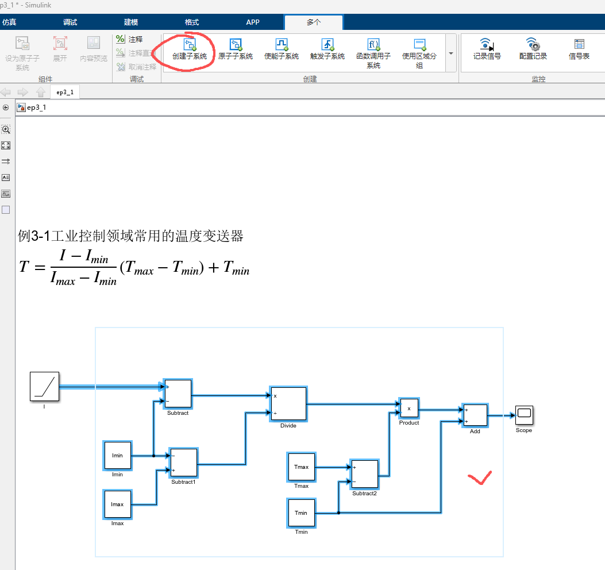

2.里面的未知数还是报错，点击创建好的子系统，右键选择：封装→创建封装，出现封装对话框
3.找到参数和对话框，点击参数那一行，在选择左侧参数中的编辑，就可以添加未知数了。顺序1→2→3

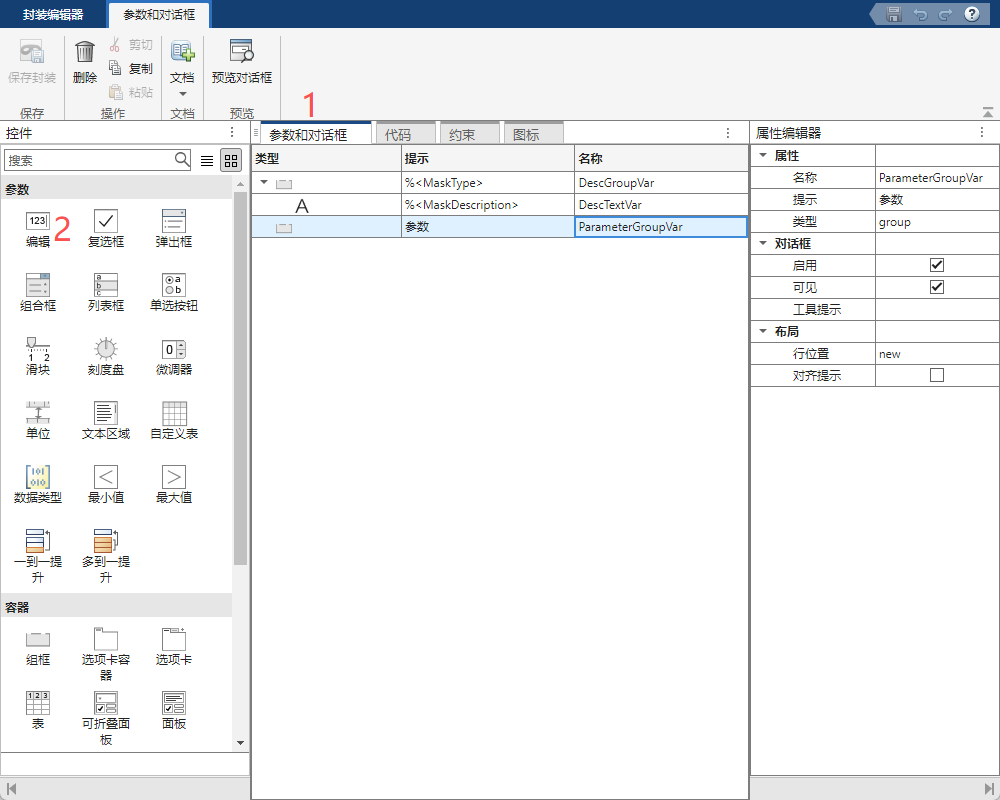


4.再将名称(Parameter)改为需要的名称，我这里是a和b。保存后错误消失。

初始化选项卡：作用绘制图标，加工用户填的参数，给子系统内部的模块提供变量
1.切换到代码。

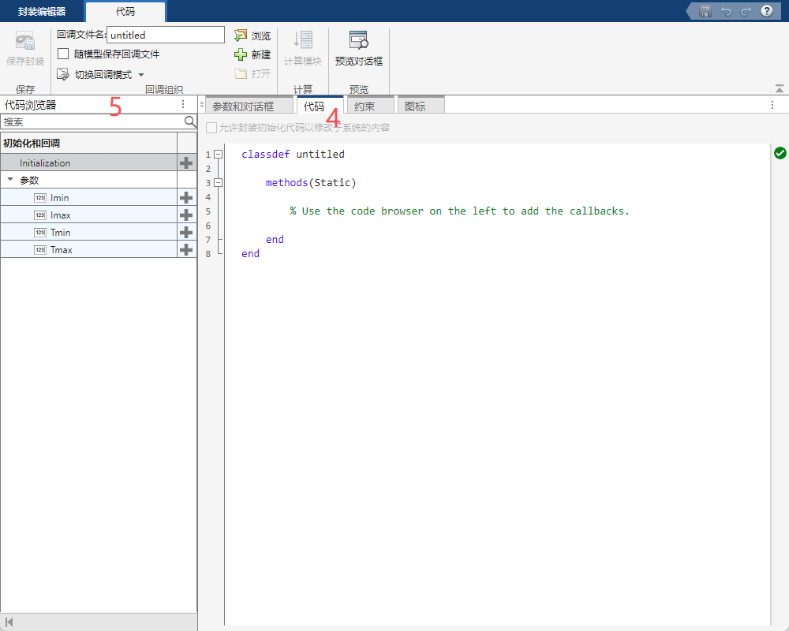

2.在菜单栏中回调组织中，点击：切换回调模式，切换到封装。然后填入函数，
我这里是函数：意思就是提前计算下
```
% Initialization code section
function initialization()
I = 4:0.1:20;
Tmax = 40;
Tmin = 30;
T = (I-5)./(15-5).*(Tmax-Tmin)+Tmin;
end
% Parameter callback section
```

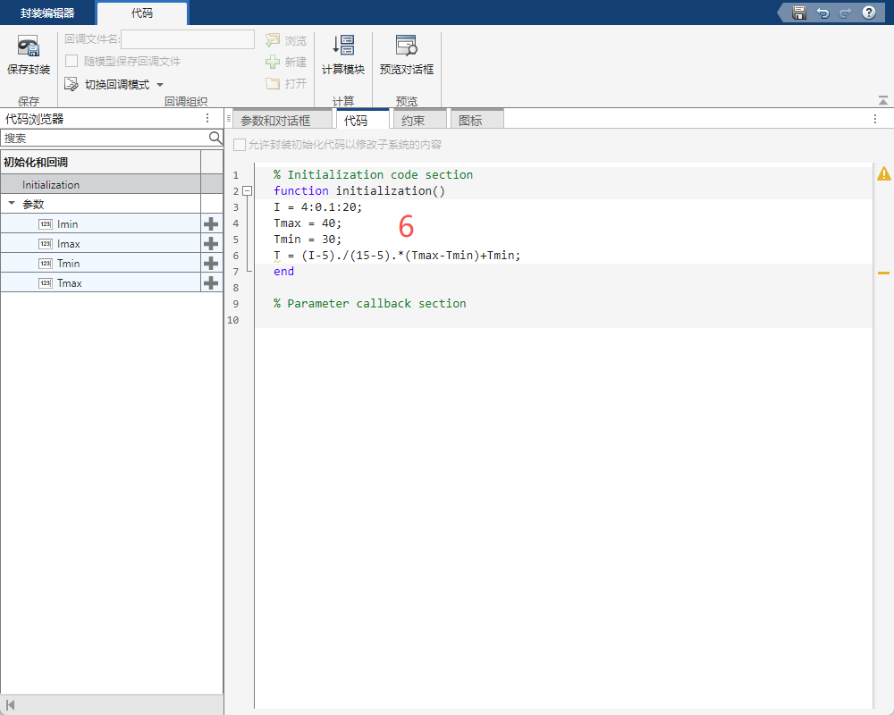


图标和选项卡设置：
1.切换到图标。
2.可以点击左侧然后输入，也可以直接输入
```
plot(I,T);
port_label('input', 1, 'I');
port_label('output', 1, 'T');
```

3.右侧的预览中运行初始化改为"On"

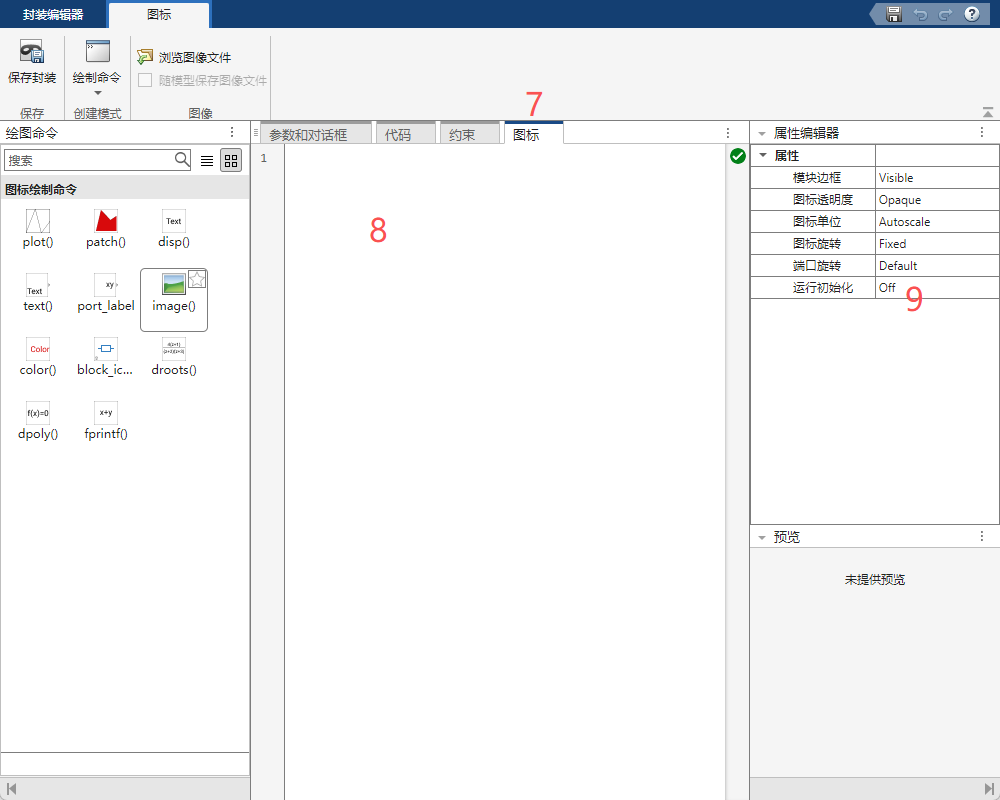
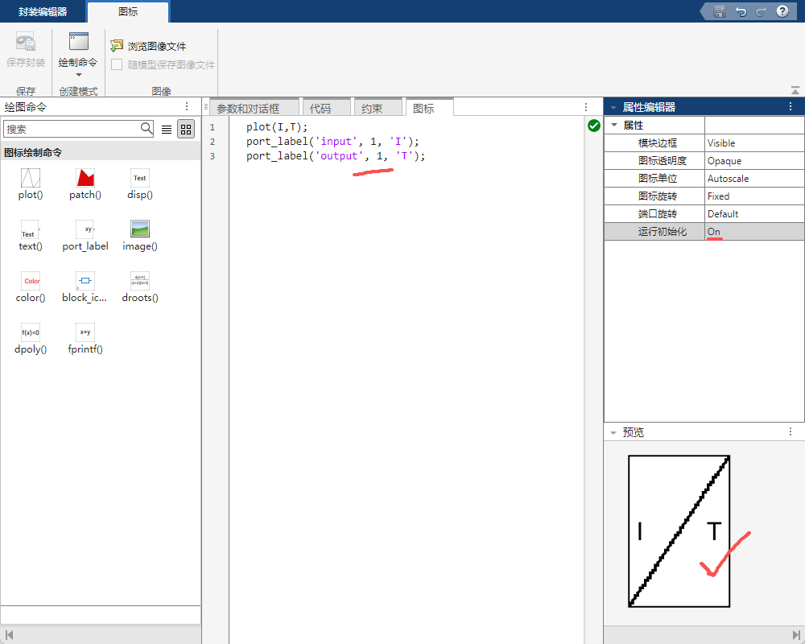

命令行输入输入命令：可直接设置参数，并且可以直接打卡仿真结果

```
load_system('ep3_1');
set_param('ep3_1/Subsystem','Imax','16','Imin','1','Tmax','90','Tmin','-20');
sim('ep3_1')
open_system('ep3_1/Scope')
```
可以直接操作直接仿真simulink。

## 3.6simulink仿真实例

例3-3 单位反馈：

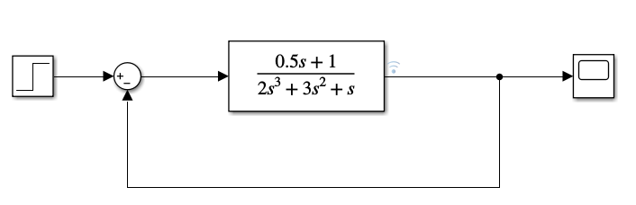

同样可以使用matlab代码写。

```
num = [0.5 1];
den = [2 3 1 0];
sys = tf(num, den);
sys_1 = feedback(sys, 1);
step(sys_1)
```

例3-4，如下图

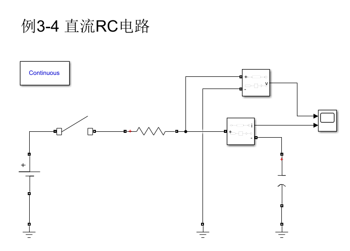

==注：==
器件来自 Simscape → Electrical → Specialized Power Systems（库名 sps_lib）。

物理端口（无箭头的 ○ 端子）只能接 sps_lib 自己的物理端口。Simscape 基础库（Foundation Library）里的电学块——比如 Electrical Reference——端子长得一模一样，但属于另一个物理域，接不上。
信号端口（带箭头）是普通 Simulink 端口，和哪个库的块都能连，Scope / Step / Gain 都行。测量类块（Voltage / Current Measurement）就是靠这个把电路量变成信号送出去。
含 SPS 块的模型必须放一个且只有一个 powergui，否则无法仿真。


Breaker模块参数含义：如下图


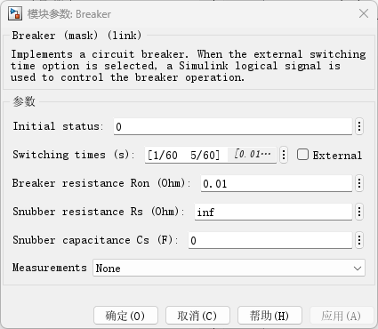

|         时刻         |           状态           |
| :----------------: | :--------------------: |
|       t = 0        | 断开（Initial status = 0） |
| t = 1/60 ≈ 16.7 ms |           闭合           |
| t = 5/60 ≈ 83.3 ms |           断开           |
如果向量里写三个数，就是"合—分—合"，以此类推。 `Initial status = 1`  的话顺序反过来，第一个时刻变成分闸。

# 第四章
## 4.1简单系统仿真
例4-1 

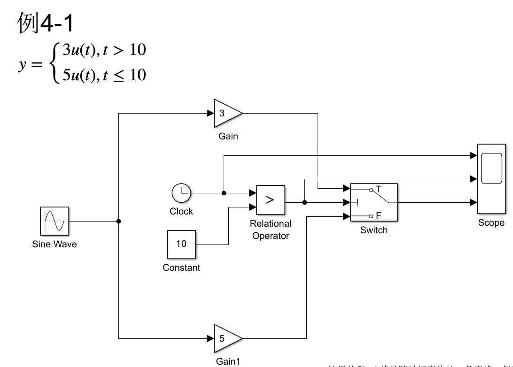
注：Relational Operator 当时间大于10的时候输出翻转为1，然后switch模块在这个上面有描述。

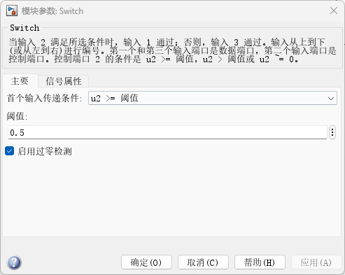


# 第五章
## 5.2.2使能子系统

例5-1
方波控制内部使能模块：

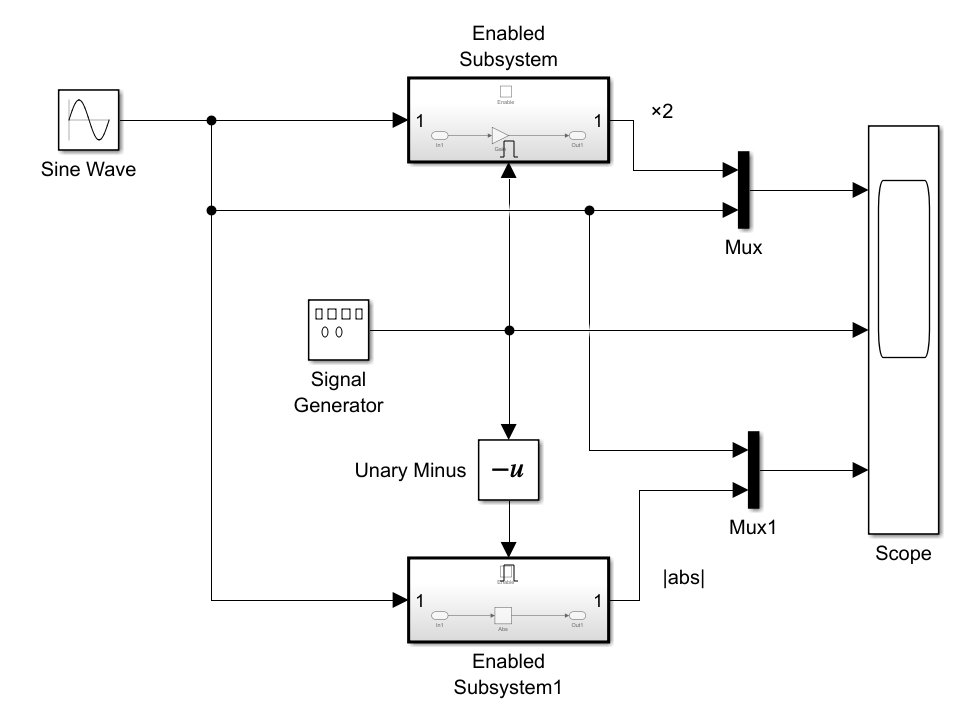


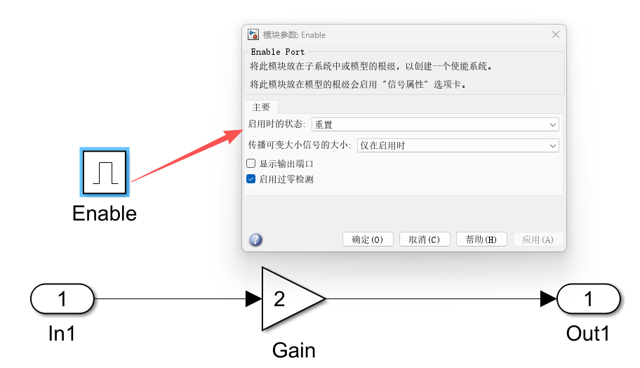

启动时的状态分为：重置和保持，也就是高低电平控制。

## 5.2.3触发子系统
例5-2

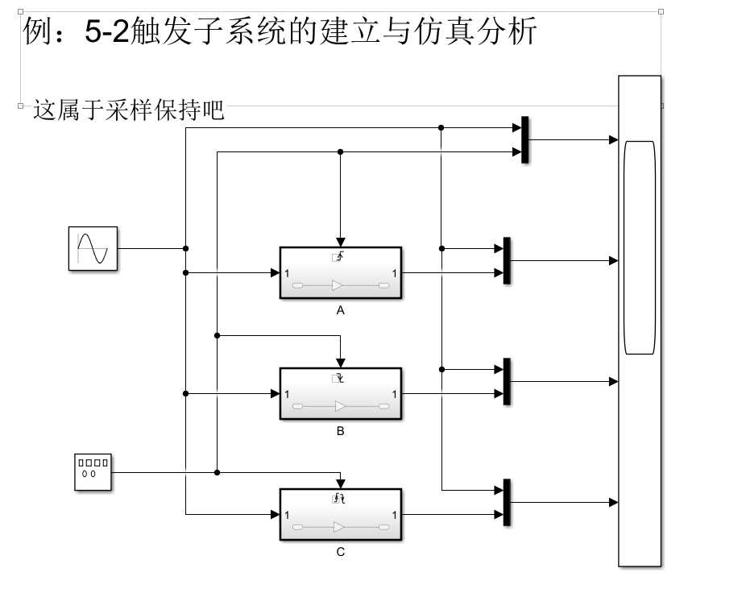

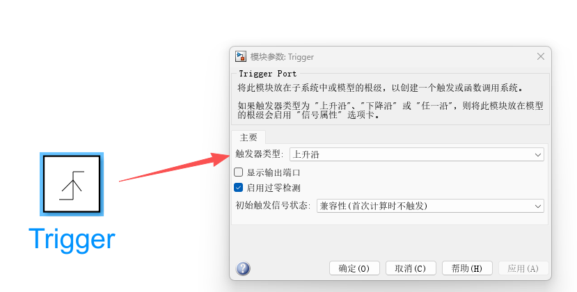

Triger分为三种：上升沿，下降沿，任一沿。

## 5.4.3库模块与引用模块的关联

simulink中模块库技术[ep_5_4_library模块库](第五章/ep_5_4_library模块库.md)

1.simulink中选择新建：库→空白库→想要创建的库放到里面→保存(.slx格式)，
2.接下来就要mask了，和之前设置的一样[ep_5_4_mask_explain封装](第五章/ep_5_4_mask_explain封装.md)如ep5_lib.slx就是已经建好的模块库。
3.建好之后就可以左键直接将模块库拖拽到你想用到的地方。
3.如果右键已经使用的模块库，库链接里面选择禁用链接，就可以修改模块库了。(修改这个库的同时你创还能得那个不会动)如下图演示

这个模块库也和之前的不一样了。禁用链接后又可以还原。

此图为模块库：

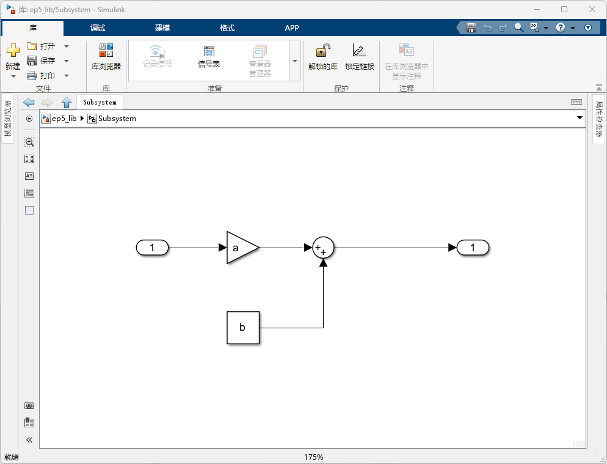

此图为调用的模块库：通过鼠标右键选择'库链接'可以改变与上图库的连接情况。
如图：上面的库是禁用链接的情况，下面的库是没禁用链接的情况。

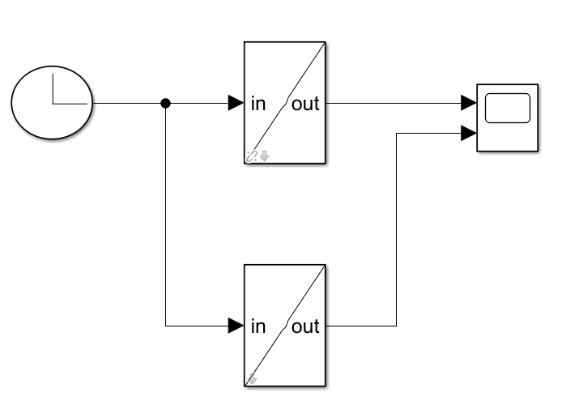

上面的那个就可以修改里面的内容了，修改后再重新还原链接就可以恢复到原来的库了。

## 5.4.4可配置子模块==(这个挺有用)==
[ep_5_4_4_可配置子系统](第五章/ep_5_4_4_可配置子系统.md)
使用的模块是Variant Subsystem，在ep_5_4_4中举例

作用：是模块相同可以通过改变模块来对参数进行调整。
1.调用Variant Subsystem
2.进入内部可以放置多个subsystem，进入每个模块内部进行模块的搭建
3.搭建好了就可以保存退出，然后右键Variant Subsystem→模块参数→变量控制项模式→标签。
4.就可以在下方的：变体选择项填写变体控制项标签了。

调整使用的模块：
右键Variant Subsystem→变体(v)→标签模式活动选择项
就可以调整使用的模块了


# 第十章


# 添加写操作语句：

fprintf用法：
```
fprintf('字符串', 变量)
```

常用格式占位符：^legend

|  占位符  |     含义      |
| :---: | :---------: |
|  %d   |     整数      |
|  %f   | 浮点数（默认6位小数） |
| % .2f |  浮点数保留两位小数  |
|  %e   |    科学计数法    |
|  %s   |     字符串     |

disp：直接输出变量值，里面写什么就输出什么

input的用法(和python一样)：
```
变量 = input('提示信息');          % 接收数字或表达式
变量 = input('提示信息', 's');     % 接收字符串
```


sort的使用，用于对矩阵进行排序：(descend是降序的意思)
```
sort([a,b,c],'descend')
```

nargin：matlab内置变量，表示实际传入的参数个数(Number of ARGuments IN) ^nargin

nargout：matlab内置变量，表示实际传除的参数个数(Number of ARGuments OUT)

legend：用于给图标添加标签。 ^legend
```
legend('y1','y2','y3', 'Location', 'northeast')  % 右上角
legend('y1','y2','y3', 'Location', 'best')       % 自动选最佳位置
```

meshgrid：把两个一维的向量扩展成两个二维矩阵，用来表示平面上所有网格点的坐标，相当于是一个矩形的方格阵列，然后用 $x_{i}y_{j}$  表示其中的一个方块的位置。 ^meshgrid
```
x = [1, 2, 3];
y = [4, 5];
[X, Y] = meshgrid(x, y)
```
```
X =            Y =
  1  2  3        4  4  4
  1  2  3        5  5  5
  
(1,4) (2,4) (3,4)    ← 第一行,y=4
(1,5) (2,5) (3,5)    ← 第二行,y=5
```
类似于我的理解，就是平铺表示每个方块。
其中x先输入表示行，y后输入表示列。

randn：生成的随机数服从正态分布，理论上是 $- \infty \to + \infty$  但实际集中在-3到3 ^randn
```
randn(m, n)   % 生成 m行n列 的随机矩阵
randn(1, 101) % 生成 1行101列 的随机行向量
```

rand：均匀分布，范围0-1


